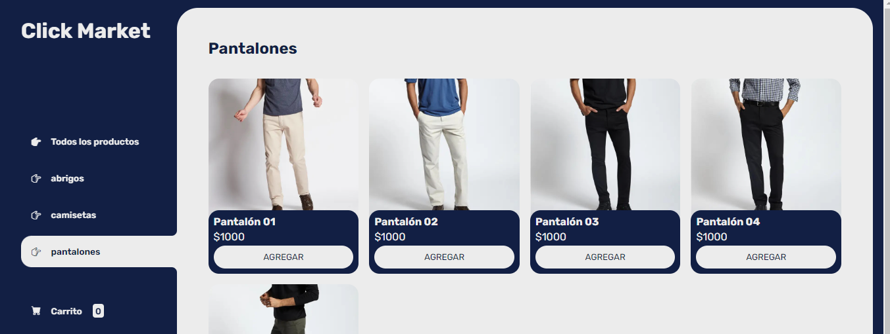

# CLICK MARKET

# ClickMarket - Tienda de Ropa

ClickMarket es una tienda en línea de ropa donde los usuarios pueden navegar, agregar productos al carrito y realizar pedidos. Este proyecto utiliza tecnologías web estándar como HTML, CSS y JavaScript, junto con LocalStorage para almacenar temporalmente los datos del carrito del usuario.

## Funcionalidades

- **Catálogo de Productos**: Los usuarios pueden ver una lista de productos disponibles.
- **Detalles del Producto**: Cada producto muestra detalles como nombre, imagen, precio y descripción.
- **Agregar al Carrito**: Los usuarios pueden agregar productos al carrito de compras.
- **Carrito de Compras**: Muestra los productos que el usuario ha seleccionado para comprar.
- **Guardar en LocalStorage**: Utiliza LocalStorage para almacenar los productos del carrito temporalmente.
- **Realizar Pedido**: Permite a los usuarios proceder a la compra de los productos en su carrito.

## Tecnologías Utilizadas

- **HTML**: Estructura básica de las páginas web.
- **CSS**: Estilos para la presentación visual de la tienda.
- **JavaScript**: Funcionalidades interactivas como agregar productos al carrito y actualizar el total.
- **LocalStorage**: Almacenamiento local para persistir los datos del carrito entre sesiones.

## Instalación y Uso

1. Clona este repositorio: `git clone https://github.com/duranangie/Ecomerce.git`
2. Abre `index.html` en tu navegador web.

## Contribución

Si deseas contribuir a este proyecto, sigue estos pasos:

1. Haz un fork del repositorio.
2. Crea una nueva rama (`git checkout -b feature/nueva-caracteristica`).
3. Realiza tus cambios y haz commit (`git commit -am 'Agrega nueva característica'`).
4. Sube tus cambios (`git push origin feature/nueva-caracteristica`).
5. Crea un nuevo Pull Request.

